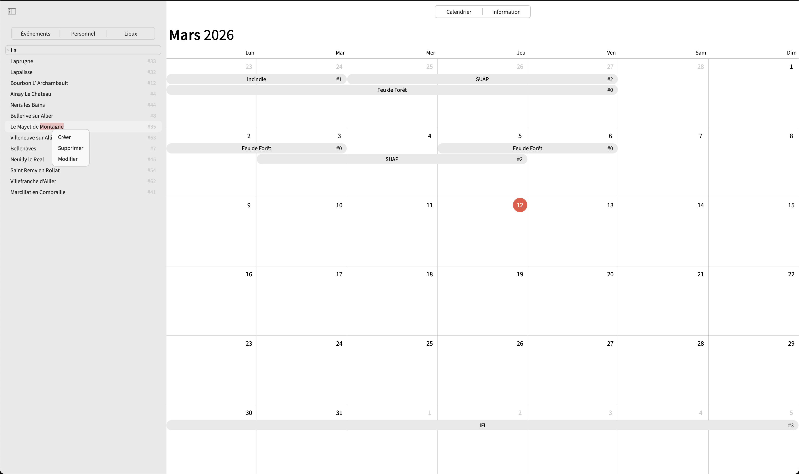
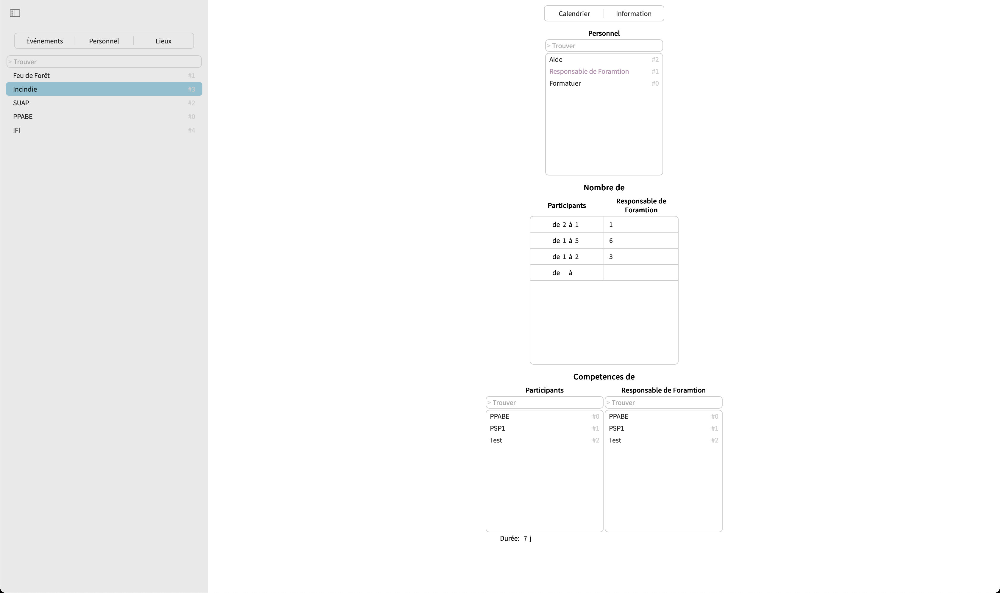

run `go build && ./calendar` and open `http://localhost:8080`

## Bugs
+ when we switch views we lose scrolling position
+ when we clean up tokens on the second turn I guess, we read from a wrong index
+ when we right click for the second time we don't clear the old options. A
solution may be to make button disappear on right click.

## Working On
+ we are moving to the new storage api. We need to make _store() callback on
end of writing. It should be a single line add.
+ we should have all systems to create the same _store() thing

## TODO
+ settings for calendar
+ show settings for events
    * rework that as a list
+ show lists of data
+ not yet planed events list
+ event placing
+ correct month swapping (almost, it can fail with fast month scrolling)
+ correct scrolling (it's laggy): Optimise DOM manipulation (no trashing)
+ Think about gc and memory managemenet 
+ Minimise object creation and try to reuse them
+ We have slope in DataManager, clean it up
+ Rewriting of read and write interface in go
+ A Year old data is stored, but is not send. We need a cache like structure,
    that separatly tracks when was the last time a particular bit of data
    was accessed. And if it is old enough, we store it in a separate file and
    touch this data only on requests.

## Browsers quirks
+ if you have >20 weeks, than calendar body stops getting the correct scaling
for some reason
