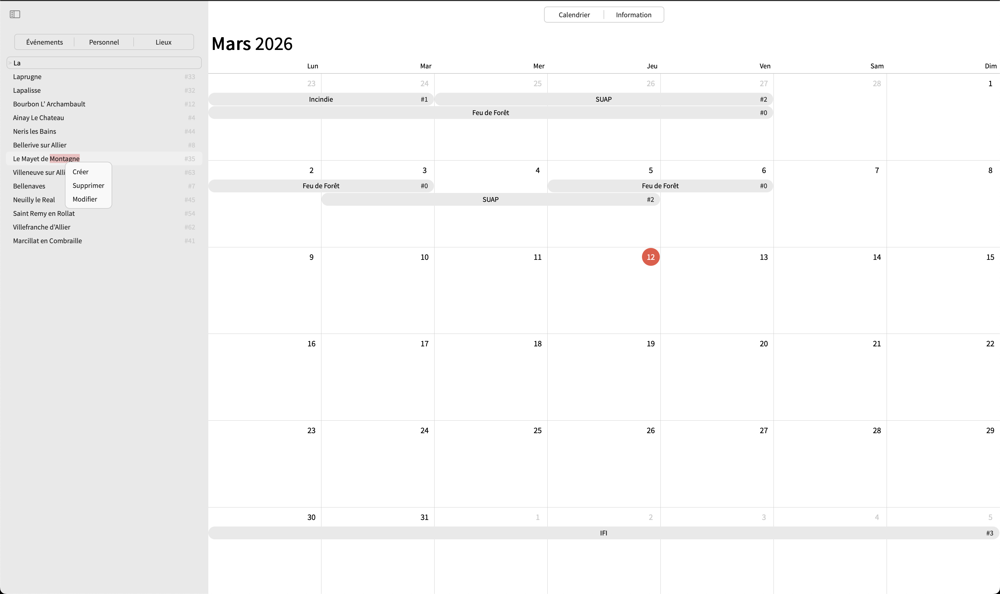
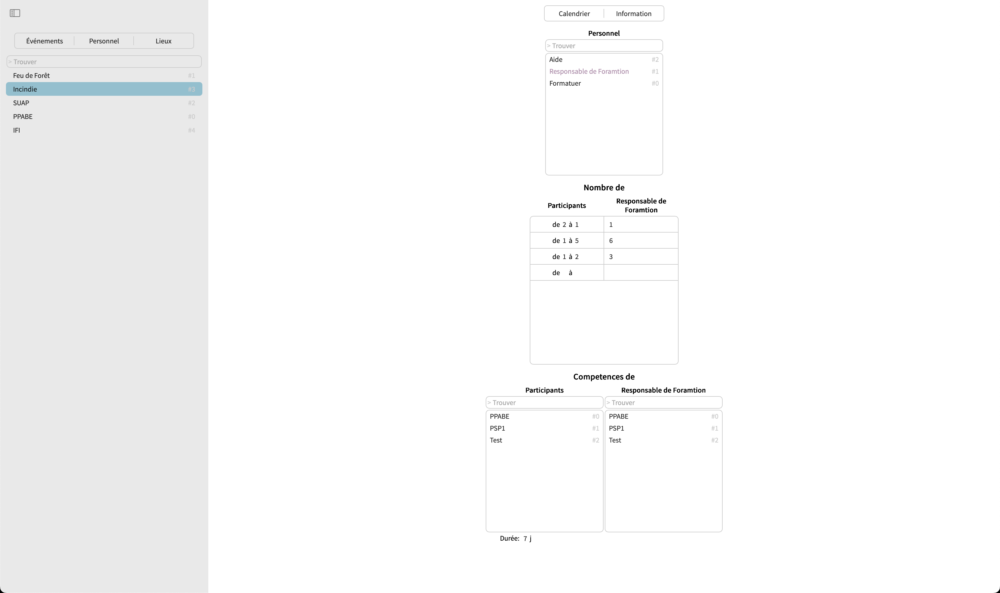

run `go build && ./calendar` and open `https://localhost`

## Bugs

## Working On
+ We are finally writing UI for lower privilage level users,/

## TODO
+ we should have a custom error window (#1)
+ not yet planed events list (#6)
+ correct scrolling (it's laggy): optimise DOM manipulation (no trashing) (#9)
+ We have slope in DataManager, clean it up (#12)
+ A Year old data is stored, but is not send. We need a cache like structure,
    that separatly tracks when was the last time a particular bit of data
    was accessed. And if it is old enough, we store it in a separate file and
    touch this data only on requests. (#14)
+ we should resend the key, if decryption fails, or as a callback on update (#15)
+ triple save + read check with sha (#16)
`todo counter: 15`

## KEEP EYE ON
+ Think about gc and memory managemenet (#1)
+ Minimise object creation and try to reuse them (#2)

## Architechture
+ Client side should fail if it sends a wrong data to server. Because in the
correctly written state it sends only correct data. And if it does not the bug
should be fixed and we do not need a backrout.
+ We are sending changes over a custom bytecode API.
+ On creation we have a bulky function that sets all callbacks

## Test targets
+ all operations with updates of data and etc

## Crash
